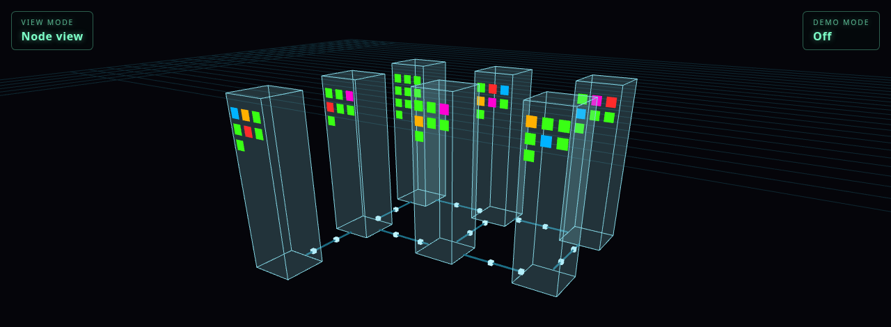
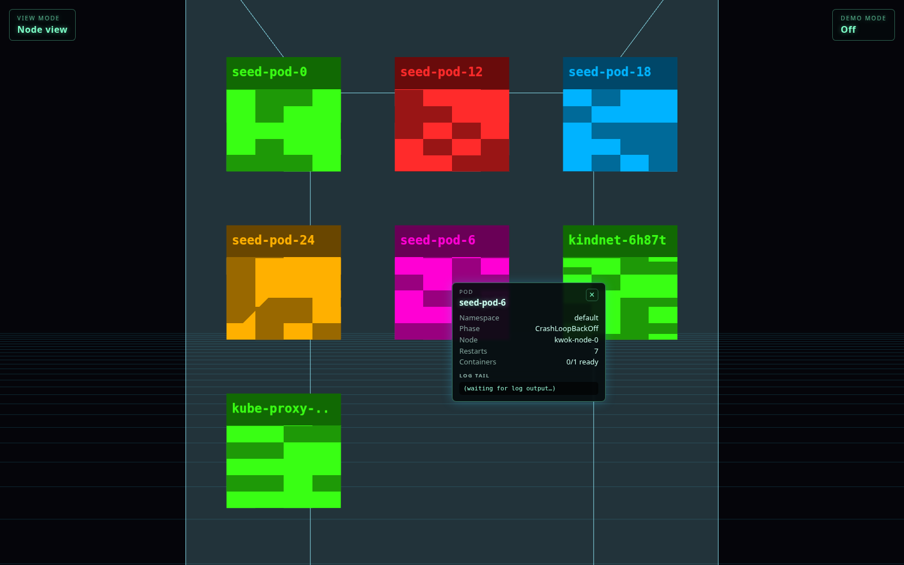
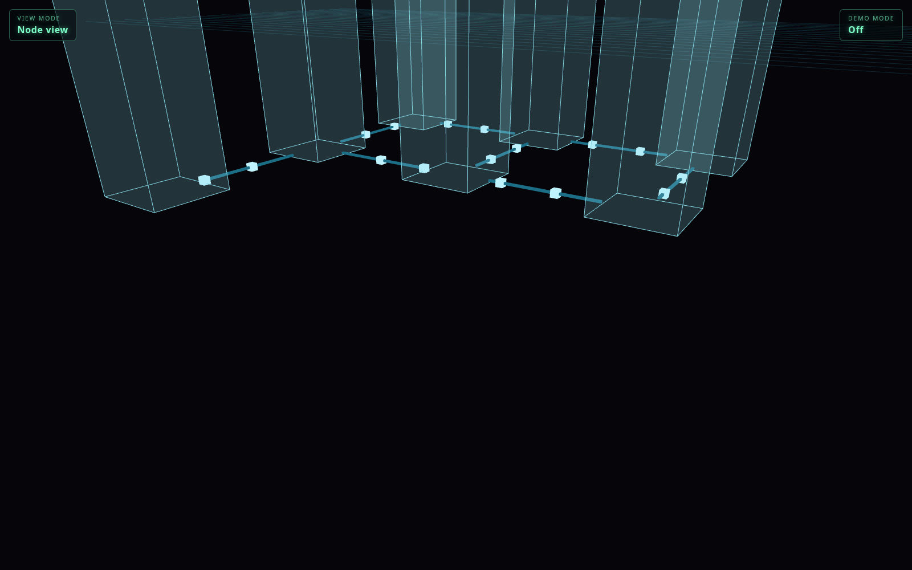
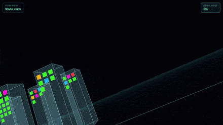

# htp-k8s

**A cinematic, *Hackers*-(1995)-styled live 3D view of your Kubernetes cluster.** Hack the planet!



## What is this?

htp-k8s turns a live Kubernetes cluster into a neon 3D city you can fly through. Each **node** is a glowing tower; each **pod** is a lit panel on its face, coloured by phase and blinking as it works; **lanes** trace the floor between them. Flip between a **Node view** and a **Namespace view**, click any tower or pod for a live **detail popup** with a log tail, or hit **Demo Mode** and let the camera thread a hands-off canyon tour through the skyline.

It's **read-only** — a thing to *watch*, styled after the 1995 film *Hackers*, not another admin dashboard.

## Quickstart

htp-k8s is a single binary (the web UI is embedded) that serves a browser UI on `:8080` against whatever cluster your current kubeconfig points at.

**Run the binary** — grab the latest build for your platform from [Releases](https://github.com/herzogf/htp-k8s/releases):

```bash
# Linux amd64 example — see Releases for your platform and the latest version
tar -xzf htp-k8s_0.2.0_linux_amd64.tar.gz
./htp-k8s                     # serves on :8080 against your current kubeconfig
# then open http://localhost:8080
```

**Or run the container image:**

```bash
docker run --rm -p 8080:8080 \
  -e KUBECONFIG=/kube/config \
  -v "$HOME/.kube/config:/kube/config:ro" \
  ghcr.io/herzogf/htp-k8s:v0.2.0
# then open http://localhost:8080
```

Your cluster has to be reachable from wherever htp-k8s runs — for a container talking to a *local* cluster on Linux, add `--network host`. htp-k8s exits immediately if it can't reach a cluster.

**Just want to try it?** Spin up a throwaway local cluster with [kind](https://kind.sigs.k8s.io/):

```bash
kind create cluster        # htp-k8s shows this single node as one lone tower
./htp-k8s
```

For a *populated* multi-tower scene (artificial [KWOK](https://kwok.sigs.k8s.io/) load) and for building from source, see **[Running & developing locally](docs/running-locally.md)**.

## Cluster support

Runs on **vanilla Kubernetes**. **OpenShift** support is planned but **not yet tested** — htp-k8s degrades gracefully when a cluster capability isn't available, but the OpenShift-specific paths haven't been validated yet.

## See it



*Detail popups — live detail and a log tail on any pod or node.*



*Floor lanes — the *Hackers* wiring running between the towers.*



*Demo Mode threads a hands-off cinematic tour through the canyon between the towers.*

## Supply chain

Every release is built in CI with **keyless, Sigstore-backed attestations** — build provenance for the binaries and the container image, plus a CycloneDX **SBOM** per artifact — and is **CVE-scanned** with Trivy. There are no keys to manage; verify what you downloaded with the [GitHub CLI (`gh`)](https://cli.github.com/):

```bash
# the release binary you downloaded
gh attestation verify htp-k8s_0.2.0_linux_amd64.tar.gz --repo herzogf/htp-k8s

# the container image (the tag resolves to the multi-arch index)
gh attestation verify oci://ghcr.io/herzogf/htp-k8s:v0.2.0 --repo herzogf/htp-k8s
```

A passing check means the artifact was built by this repo's release workflow and hasn't been tampered with since. More on the posture: [ADR-0005](docs/adr/0005-supply-chain-security-posture.md).

## Docs & further reading

- **[Running & developing locally](docs/running-locally.md)** — build from source and stand up a populated multi-tower scene (kind + KWOK).
- For technical background and design decisions, see **[CONTEXT.md](CONTEXT.md)** and the **[ADRs](docs/adr/)**.

## License

[Apache License 2.0](LICENSE).
